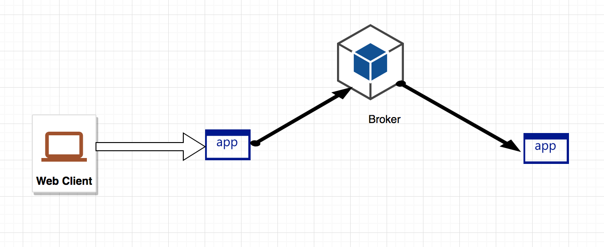

## Introduction
For developers in the age of micro services, we often need to test our containers locally. 
Just with Docker community version, there are `bridge, host, overlay, macvlan` , etc. For developers it is hard to manage these concepts. And sometimes they even require code or configuration changes. 

But all we want is one app to able to talk to another. We believe networking shouldn't be a concern for programmers.
In this demo, we will showcase one use case of RSocket Broker, which simplifies Docker networking model.

## Demo setup
The demo has 3 parts: An RSocket broker, an RSocket server that answers the query and an RSocket client with is a web server that listens to http requests and dispatches the request to the server.   

All three parts are in Docker images.   
Next, let's see how to deploy them.   

## Simple steps

This is the simple version where most demos will be wrapped up with: Docker compose. The benefit of this model is:   
"By default Compose sets up a single network for your app. Each container for a service joins the default network and is both reachable by other containers on that network, and discoverable by them at a hostname identical to the container name."   

* `git clone https://github.com/szihai/broker-flat.git`
* `cd broker-flat`
* `docker-compose up`   
After a while, all three containers will be up.        
Now let's test the result:   
* `curl http://localhost:8181/user/2`   
Not suprisingly, you can see the result in the form of json code : 
`{"id":2,"nick":"Otha Kovacek"}`   
* Stop the containers:     
`docker-compose down`

Next, let's examine the solution with RSocket Broker.

## Deploy regardless of the networking
We have deployed a sample broker in public cloud, with ip:port `47.254.15.246:9999`. When we start the other two containers, we'll pass this as environmental variables. And then it doesn't matter where you run your RSocket server and client. They will be able to talk to each other.

* `docker run -e RSOCKET_BROKERS=tcp://47.254.15.246:9999 rsocket/rsocket-server`
* `docker run -e RSOCKET_BROKERS=tcp://47.254.15.23:9999 -p 8181:8181 rsocket/rsocket-client`
The port 8181 is open for web traffic, not for RSocket.
Now let's test the result:  
* `curl http://localhost:8181/user/2`   
Again, the result should be the same.

## Under the hood
RSocket is an application protocol implementing [Reactive Streams](https://en.wikipedia.org/wiki/Reactive_Streams).    
The RSocket Broker, by its name, has two features: It is a broker just like other brokers and it is implenting reactive streams.  

The broker is just like a router. It dispatches traffic. So why not other brokers? Like, for example, Kafka.   
It turns that other brokers are not easy to set up. Your application is joining a cluster. And there are steps needed to manage that cluster. In the end you are better off using Docker networks.    
Whereis the RSocket broker is pretty simple to connect to. The connection is just like dialing to any server. And all this thanks to the great design of RSocket protocol and its communication models. To learn more, please check out [RSocket](rsocket.io/).

Now let's try to deploy your own broker.   

## Deploy your own broken
We are not going to get into the details of the deployment. You can try it on a VM, or run it in another Docker engine or deploy it in Kubernetes cluster. All we need in the end is an accesible ip and port. 
**If you use Kubernetes, remember to use Load Balancer instead of Ingress to open up the access since Ingress only takes HTTP traffice.

Repeat the steps in the previous section, replacing the the commands using your own `ip:port`. And it should yield the same results.

## Conclulsion
Networking is complicated. But the programmers only need connectivity, under mose cases. By using an RSocket Broker, we can bypass this complexicity. Your applications will run the same way whether it's in your IDE, in your vms or containers.

## License
Please refer to the [License](LICENSE) file.
